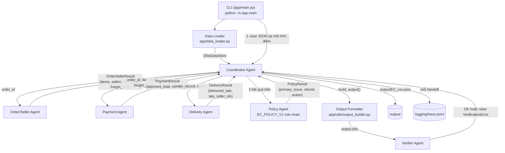

# Architecture — Multi-Agent E-commerce Dispute Resolution

## 1. Tổng quan

Pipeline xử lý mỗi case trong `input/EC_*.json` bằng năm agent chuyên trách, phối hợp qua một Coordinator, và một Verifier độc lập kiểm tra kết quả trước khi ghi file. Toàn bộ hệ thống là Python thuần + pandas, **không gọi model nào để quyết định số tiền hoặc root cause** — mọi quy tắc nghiệp vụ nằm trong `app/agents/policy_agent.py` dưới dạng hàm thuần (pure function), cùng input luôn cho cùng output.

## 2. Sơ đồ agent



Mỗi mũi tên là một **handoff thật**: agent nhận vào một dataclass đã định kiểu (`OrderSellerResult`, `PaymentResult`, `DeliveryResult`, `PolicyResult` trong `app/schemas.py`), không truyền dict tự do, và Coordinator ghi một dòng trace cho mỗi bước.

## 3. Trách nhiệm từng agent

| Agent | File | Trách nhiệm | KHÔNG làm |
| --- | --- | --- | --- |
| Data Loader | `app/data_loader.py` | Đọc 8 CSV Olist, dựng index theo `order_id`, `seller_id`, `customer_id`, item/payment theo `order_id`; parse timestamp bằng `pandas.to_datetime(errors="coerce")`; tiền dùng `Decimal` | Không suy diễn quy tắc nghiệp vụ |
| Order/Seller Agent | `app/agents/order_seller_agent.py` | Trả order record, `order_status`, danh sách item (sort theo `order_item_id`), `seller_ids` (unique, sort), `item_total`, `freight_total` | Không đọc payment, không đọc timestamp giao hàng |
| Payment Agent | `app/agents/payment_agent.py` | Tổng `payment_value` theo `order_id`, so khớp với `item_total + freight_total` (sai số ≤ 0.10 BRL) | Không tự tính lại item/freight total, không cộng `payment_installments` |
| Delivery Agent | `app/agents/delivery_agent.py` | So `order_delivered_customer_date` với `order_estimated_delivery_date`; so `order_delivered_carrier_date` với `shipping_limit_date` của **từng item** để xác định seller vi phạm | Không suy đoán khi thiếu timestamp — trả `None` (không phải `False`) |
| Policy Agent | `app/agents/policy_agent.py` | Áp 6 rule theo đúng thứ tự ưu tiên EC_POLICY_V1 dưới dạng hàm thuần `rule_*(PolicyInputs) -> Optional[RuleOutcome]` | Không đọc CSV, không gọi model, không phụ thuộc thời gian hệ thống |
| Output Formatter | `app/utils/output_builder.py` | Map 4 kết quả agent → đúng schema README, cắt giới hạn ID/evidence, làm tròn tiền 1 lần duy nhất | Không quyết định nghiệp vụ |
| Verifier Agent | `app/agents/verifier_agent.py` | Kiểm schema, ID tồn tại thật trong `OlistDataStore`, evidence đúng format & tồn tại, tổng tiền khớp, refund/action khớp `primary_issue` (bảng tra độc lập, không tái dùng `RuleOutcome` của Policy Agent), confidence ∈ [0,1], giới hạn số lượng, JSON serializable | Không tự sửa output — chỉ raise `VerificationError` |
| Coordinator | `app/agents/coordinator.py` | Điều phối handoff, trích `claimed_order_id`, ghi trace mỗi bước, raise lỗi rõ ràng khi order không tồn tại hoặc input case sai định dạng | Không tự quyết định policy, không bắt lỗi để giả vờ thành công |

## 4. Input/Output contract

- **Input mỗi agent nhận**: dataclass do agent trước trả (không phải dict thô), trừ Order/Seller Agent nhận `order_id: str` từ Coordinator và Data Loader nhận đường dẫn thư mục CSV.
- **Output mỗi agent trả**: một dataclass trong `app/schemas.py` (`OrderSellerResult`, `PaymentResult`, `DeliveryResult`, `PolicyResult`) — không rò rỉ `pandas.DataFrame` hay object CSV thô ra khỏi Data Loader.
- **Output cuối cùng**: JSON đúng schema README section 6, ghi vào `output/<case_id>.json`.

## 5. Quyền truy cập dữ liệu

| Agent | Được đọc | Không được đọc |
| --- | --- | --- |
| Data Loader | Toàn bộ `data/*.csv` | — |
| Order/Seller Agent | `OlistDataStore.orders`, `.items_by_order`, `.sellers` (qua accessor) | `payments_by_order` (không tự suy diễn payment) |
| Payment Agent | `OlistDataStore.payments_by_order` + `item_total`/`freight_total` do Order/Seller Agent truyền vào | Không tự đọc lại `order_items.csv` |
| Delivery Agent | `OrderRecord` + `list[ItemRecord]` do Coordinator truyền vào | Không tự query `OlistDataStore` |
| Policy Agent | Chỉ `PolicyInputs` (giá trị nguyên thuỷ: Decimal, bool, Optional[bool], tuple[str]) | Không có tham chiếu tới `OlistDataStore` — đảm bảo là hàm thuần, test được mà không cần dữ liệu Olist |
| Verifier Agent | `OlistDataStore` (để xác minh ID tồn tại thật) + output dict + 4 kết quả agent | Không ghi file, không sửa output |

`customers`, `products`, `order_reviews`, `product_category_name_translation` được Data Loader nạp và index đầy đủ theo README section 1 (customer_id, product_id, review theo order_id, category translation) và có accessor (`get_customer`, `get_product`, `get_reviews`, `translate_category`) để mở rộng về sau; các rule nghiệp vụ hiện tại không cần đến chúng nên không agent nghiệp vụ nào phụ thuộc vào 4 file này.

## 6. Thứ tự handoff (một case)

```
1. Coordinator đọc input/EC_xxx.json, lấy customer_request.claimed_order_id
2. Coordinator -> Order/Seller Agent (order_id)
   Order/Seller Agent -> Coordinator (OrderSellerResult)
   [nếu order không tồn tại: raise OrderNotFoundError, case dừng ở đây]
3. Coordinator -> Payment Agent (order_id, item_total, freight_total)
   Payment Agent -> Coordinator (PaymentResult)
4. Coordinator -> Delivery Agent (order_id, order_record, items)
   Delivery Agent -> Coordinator (DeliveryResult)
5. Coordinator -> Policy Agent (OrderSellerResult, PaymentResult, DeliveryResult)
   Policy Agent -> Coordinator (PolicyResult)
6. Coordinator -> Output Formatter (4 kết quả trên) -> output dict
7. Coordinator -> Verifier Agent (case_input, output dict, 4 kết quả trên)
   [nếu verify thất bại: raise VerificationError, không ghi file]
8. Coordinator ghi output/<case_id>.json
```

Mỗi bước 2–7 ghi một dòng vào `logging/trace.jsonl` gồm `timestamp`, `case_id`, `agent`, `event`, `input_summary`, `output_summary`.

## 7. Verifier hoạt động như thế nào

Verifier **không tin tưởng mù quáng** Policy Agent — nó dùng một bảng tra kỳ vọng riêng (`EXPECTED_ACTION_BY_ISSUE`, `EXPECTED_CASE_STATUS_BY_ISSUE`, `EXPECTED_REFUND_BASIS_BY_ISSUE` trong `verifier_agent.py`) được viết độc lập với `RULE_CHAIN` của Policy Agent, để một lỗi trong Policy Agent không tự động "qua mặt" Verifier. Các bước kiểm tra theo thứ tự:

1. Schema đầy đủ đúng kiểu dữ liệu (dừng sớm nếu thiếu field — các bước sau sẽ không đáng tin).
2. `case_id` output khớp `case_id` input.
3. Mọi ID trong `affected_entities` tồn tại thật trong `OlistDataStore` (order/item/payment/seller).
4. Giới hạn số lượng ID/evidence/cause/party/action đúng README.
5. Mỗi `evidence_id` đúng định dạng regex và tồn tại thật; riêng `policy:<cause_code>` phải khớp đúng `cause_code` Policy Agent đã kết luận (không phải bất kỳ cause_code hợp lệ nào).
6. `item_total_brl`, `freight_total_brl`, `payment_total_brl` khớp tổng tính từ CSV (sai số ≤ 0.005 do làm tròn).
7. `recommended_refund_brl` và `resolution_actions` khớp `primary_issue` theo bảng tra độc lập ở trên.
8. `confidence` ∈ [0, 1].
9. Toàn bộ output `json.dumps` được (không có `Decimal`, `NaN`, `set`, ...).

Nếu bất kỳ bước nào lỗi, `VerificationError` được raise với **toàn bộ danh sách lỗi tìm được** (không dừng ở lỗi đầu tiên, trừ lỗi schema) — Coordinator/CLI bắt lỗi này, ghi vào trace + báo cáo console, **không ghi file output cho case đó**, và tiếp tục case tiếp theo.

## 8. Vì sao dùng deterministic policy engine thay vì LLM

- **Tái lập được**: cùng input CSV + input case luôn cho đúng một output — cần thiết để chấm điểm công bằng và để Verifier có thể kiểm tra lại bằng công thức, không phải bằng "hỏi lại model".
- **Tiền và root cause là dữ kiện, không phải văn bản tự do**: số tiền hoàn (refund) phải khớp chính xác đến 2 chữ số thập phân với dữ liệu Olist — một LLM ước lượng số tiền có rủi ro sai lệch (hallucination) mà không có cách nào chứng minh đúng/sai ngoài so khớp lại với CSV, lúc đó bản thân việc dùng LLM trở thành thừa.
- **README yêu cầu rõ**: "Ưu tiên xử lý deterministic bằng Python, không để LLM tự suy đoán số tiền hoặc root cause" — 6 rule trong bảng nghiệp vụ là quan hệ if/else rõ ràng trên dữ liệu có cấu trúc, không cần suy luận ngôn ngữ tự nhiên.
- **Multi-agent ở đây nghĩa là phân chia trách nhiệm miền dữ liệu** (order/seller, payment, delivery, policy, verification), không phải nhiều lời gọi model. Việc "handoff" là truyền dataclass đã định kiểu giữa các class Python — kiểm thử được từng agent độc lập bằng dữ liệu giả lập (`tests/fixtures/`) mà không cần gọi API nào.

## 9. Xử lý biên đã cân nhắc (documented assumptions)

- **Timestamp null**: nếu `order_delivered_customer_date` hoặc `order_estimated_delivery_date` null → `delivered_late = None` (không phải `False`). Rule 3/4 chỉ khớp khi `delivered_late is True`; Rule 6 chỉ khớp khi `delivered_late is False` (đã xác nhận chắc chắn đúng hạn) — `None` không khớp rule nào trong hai nhóm này, tránh việc "giao hàng chưa xác định" bị mặc định coi là đúng hạn.
- **Không rule nào khớp** (ví dụ: order không có item, không có payment, và không xác định được delivery): rơi vào `PRIMARY_ISSUE_UNCLASSIFIED` / `cause_code=INSUFFICIENT_EVIDENCE_FOR_POLICY_MATCH`, `case_status=no_action`, `refund=0.0` — không nằm trong 6 rule của README nhưng được ghi rõ trong code (`policy_agent.py` docstring) và trace (`warnings`), và không bao giờ tạo ra refund giả.
- **Nhiều seller vi phạm cùng lúc**: `responsible_parties` liệt kê tất cả seller có ít nhất 1 item bàn giao trễ (tối đa 3 theo giới hạn README).
- **Order không tồn tại**: Coordinator raise `OrderNotFoundError` ngay, không sinh output, được CLI báo cáo là case thất bại (không phải "no_action").

## 10. Kiểm thử

- `tests/test_policy_rules.py`: kiểm 6 rule + thứ tự ưu tiên + boundary payment tolerance (0.09/0.10/0.11) bằng `PolicyInputs` thuần, không cần CSV.
- `tests/test_verifier.py`: kiểm verifier bắt được từng loại lỗi (ID không tồn tại, evidence sai format/sai cause_code, refund sai, giới hạn số lượng, không JSON-serializable) bằng `OlistDataStore.from_dataframes(...)` dựng từ fixture nhỏ trong `tests/fixtures/`.
- `scripts/check_input.py`: báo cáo rõ ràng nếu `input/EC_001.json..EC_050.json` chưa đủ 50 file — không tự sinh dữ liệu giả để lấp chỗ trống.
- `scripts/validate_outputs.py`: kiểm tra độc lập toàn bộ `output/*.json` (không chạy lại pipeline) — parse JSON, đối chiếu lại với `data/` bằng chính `OlistDataStore` và `VerifierAgent`.
